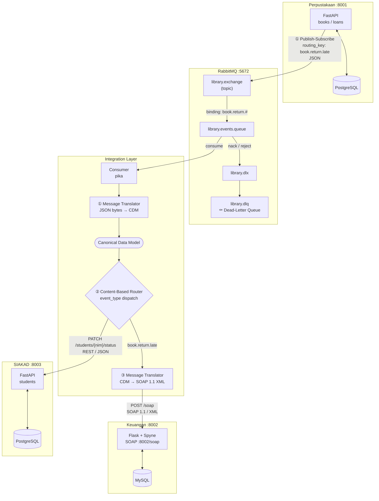

# SIAKAD × Keuangan × Perpustakaan — Integrasi Event-Driven Berbasis RabbitMQ

> Tugas Besar Mata Kuliah **Integrasi Aplikasi Enterprise** — Semester 4

**Anggota Kelompok:**

| NIM | Nama |
|-----|------|
| 102022400067 | Paris |
| 102022400046 | Jazman Jati Muhtadi |

Proyek ini mengintegrasikan tiga sistem informasi kampus yang heterogen menggunakan arsitektur *event-driven* berbasis **RabbitMQ** dan pola-pola **Enterprise Integration Patterns (EIP)**.

> **Dokumen pendukung:** [proposal.md](proposal.md) — tema, daftar aplikasi & format data, diagram arsitektur | [spesifikasi.md](spesifikasi.md) — spesifikasi teknis | [laporan.md](laporan.md) — laporan EIP & transformasi data

---

## Arsitektur Sistem

```
┌─────────────────────────────────────────────────────────────────────┐
│  Sistem Mandiri (Bounded Context)                                   │
│                                                                     │
│  ┌──────────────────┐  ┌──────────────────┐  ┌──────────────────┐  │
│  │  Perpustakaan    │  │    Keuangan       │  │     SIAKAD       │  │
│  │  FastAPI :8001   │  │  Flask+Spyne :8002│  │  FastAPI :8003   │  │
│  │  PostgreSQL      │  │  MySQL            │  │  PostgreSQL      │  │
│  └────────┬─────────┘  └────────▲──────────┘  └──────▲──┬────────┘  │
└───────────┼──────────────────────┼──────────────────────┼──┼─────────┘
            │                     │ SOAP/XML              │  │ REST/JSON (fetch mahasiswa)
            │ Publish-Subscribe    │ (Message Translator)  │  └──────────────────────────►│
            │ JSON event           │                       │ REST/JSON (update utang)      │
            ▼                     │                       │ REST/JSON (suspensi)          │
┌───────────────────────────────────┼───────────────────────┼──────────────────────────────┘
│  RabbitMQ (library.exchange)      │                       │
│   routing_key: book.return.late   │                       │
│                ▼                  │                       │
│   library.events.queue            │                       │
│         ↓ (on reject)             │                       │
│   library.dlq (Dead-Letter)       │                       │
└─────────────────┬─────────────────┼───────────────────────┼──────────┘
                  │ consume          │                       │
                  ▼                 │                       │
┌─────────────────────────────────────────────────────────────────────┐
│  Integration Layer (Pure Python / pika)                             │
│                                                                     │
│  [1] Message Translator: JSON raw bytes → Canonical Data Model      │
│  [2] Content-Based Router: dispatch by event_type                   │
│  [3] Message Translator: CDM → SOAP 1.1 Envelope (XML)             │
│       └→ POST /soap ─────────────────────────────────────────────► │
│  [4] REST call: PATCH /students/{nim}/library-debt ──────────────► │
│  [5] REST call: PATCH /students/{nim}/status ────────────────────► │
└─────────────────────────────────────────────────────────────────────┘
```

Sistem bekerja *loosely coupled* untuk komunikasi event-driven. Selain itu, **Perpustakaan mengambil data mahasiswa langsung dari SIAKAD** (REST sinkron) saat peminjaman dibuat — menjadikan SIAKAD sebagai satu-satunya sumber data otoritatif untuk mahasiswa.

---

## Daftar Sistem & Endpoint

### 1. Perpustakaan (`localhost:8001`)

| Method | Path | Deskripsi |
|--------|------|-----------|
| `GET` | `/students/{nim}` | Cek mahasiswa — fetch otomatis dari SIAKAD jika belum di cache lokal |
| `POST` | `/books/` | Tambah buku baru |
| `GET` | `/books/` | Daftar semua buku |
| `GET` | `/books/{book_id}` | Detail buku |
| `POST` | `/loans/` | Buat transaksi peminjaman — **auto-fetch mahasiswa dari SIAKAD** |
| `PATCH` | `/loans/{loan_id}/return` | Kembalikan buku — **memicu event RabbitMQ jika terlambat** |

> Pendaftaran mahasiswa manual (`POST /students/`) **dihapus** — data mahasiswa sepenuhnya bersumber dari SIAKAD.
>
> Dokumentasi interaktif: `http://localhost:8001/docs`

### 2. Keuangan (`localhost:8002`)

| Method | Path | Deskripsi |
|--------|------|-----------|
| `POST` | `/soap` | Endpoint SOAP 1.1 — operasi `CreateFine` |
| `GET` | `/soap?wsdl` | WSDL descriptor layanan |

> Dikonsumsi **hanya** oleh Integration Layer; tidak dimaksudkan untuk dipanggil langsung oleh klien akhir.

### 3. SIAKAD (`localhost:8003`)

| Method | Path | Deskripsi |
|--------|------|-----------|
| `POST` | `/students/` | Tambah data mahasiswa |
| `GET` | `/students/{nim}` | Detail mahasiswa — **termasuk `library_debt` dan `library_debt_notes`** |
| `PATCH` | `/students/{nim}/status` | Perbarui status akademik (ACTIVE / SUSPENDED / GRADUATED) |
| `PATCH` | `/students/{nim}/library-debt` | Catat utang perpustakaan — dipanggil oleh Integration Layer |

> Dokumentasi interaktif: `http://localhost:8003/docs`

### 4. RabbitMQ Management UI

| URL | Kredensial |
|-----|-----------|
| `http://localhost:15672` | `admin` / `admin_r4bbit_secret` |

---

## Format Pertukaran Data

### JSON — Event dari Perpustakaan ke RabbitMQ

Dipublikasikan ke exchange `library.exchange` dengan routing key `book.return.late`.

```json
{
  "event_id": "f47ac10b-58cc-4372-a567-0e02b2c3d479",
  "event_type": "book.return.late",
  "timestamp": "2025-06-02T08:30:00+00:00",
  "student": {
    "id": "a1b2c3d4-e5f6-7890-abcd-ef1234567890",
    "nim": "102022400067",
    "name": "Paris"
  },
  "book": {
    "id": "b9c8d7e6-f5a4-3210-fedc-ba9876543210",
    "title": "Pengantar Sistem Informasi Enterprise",
    "isbn": "978-602-1234-56-7"
  },
  "loan": {
    "id": "c3d4e5f6-a7b8-9012-3456-789012345678",
    "due_date": "2025-05-23T00:00:00",
    "return_date": "2025-06-02T00:00:00",
    "overdue_days": 10,
    "fee_per_day": "5000.0",
    "total_fee": "50000.0",
    "currency": "IDR"
  }
}
```

### XML — SOAP Envelope dari Integration Layer ke Keuangan

Dihasilkan oleh **Message Translator** (CDM → SOAP) menggunakan `lxml`, dikirim via `POST /soap`.

> Semua elemen parameter wajib memakai prefix namespace `tns:` agar lolos validasi XSD Spyne.

```xml
<?xml version='1.0' encoding='UTF-8'?>
<soapenv:Envelope
    xmlns:soapenv="http://schemas.xmlsoap.org/soap/envelope/"
    xmlns:tns="http://keuangan.eai.university/soap">
  <soapenv:Header/>
  <soapenv:Body>
    <tns:CreateFine>
      <tns:studentNim>2024001</tns:studentNim>
      <tns:studentName>Budi Santoso</tns:studentName>
      <tns:loanId>f853a241-1c41-4341-beb3-334febea7afc</tns:loanId>
      <tns:bookTitle>Pemrograman Python Modern</tns:bookTitle>
      <tns:totalFee>135000.0</tns:totalFee>
      <tns:overdueDays>27</tns:overdueDays>
      <tns:currency>IDR</tns:currency>
    </tns:CreateFine>
  </soapenv:Body>
</soapenv:Envelope>
```

### JSON — REST call dari Integration Layer ke SIAKAD (Utang Perpustakaan)

```json
PATCH /students/2024001/library-debt

{
  "amount": 135000.0,
  "notes": "[2026-06-11] Keterlambatan pengembalian buku \"Pemrograman Python Modern\" selama 27 hari. Denda: IDR 135000.0. Ref tagihan: 0cc2c5e3-..."
}
```

### JSON — REST call dari Integration Layer ke SIAKAD (Suspensi)

```json
PATCH /students/2024001/status

{
  "status": "SUSPENDED",
  "reason": "Keterlambatan pengembalian buku \"Pemrograman Python Modern\" selama 27 hari. Denda: IDR 135000.0. Referensi tagihan: 0cc2c5e3-..."
}
```

---

## Topologi RabbitMQ

```
library.exchange (topic)
    └── binding: book.return.#
            ▼
    library.events.queue
        │
        └── x-dead-letter-exchange: library.dlx
                    ▼
            library.dlq  ← pesan gagal / ditolak permanen
```

| Komponen | Tipe | Keterangan |
|----------|------|-----------|
| `library.exchange` | topic | Publisher utama Perpustakaan |
| `library.events.queue` | durable queue | Antrian konsumsi Integration Layer |
| `library.dlx` | direct exchange | Dead-Letter Exchange |
| `library.dlq` | durable queue | Penampung pesan gagal untuk audit |

---

## Diagram Arsitektur (Mermaid)



---

## Cara Menjalankan dari Nol

### Prasyarat

- [Docker Desktop](https://www.docker.com/products/docker-desktop/) (versi 24+)
- Docker Compose v2 (sudah termasuk dalam Docker Desktop)

### Langkah-langkah

**1. Clone / ekstrak repositori**

```bash
cd "Semester 4/INTEGRASI APLIKASI ENTERPRISE/Tugas Besar"
```

**2. Salin konfigurasi environment**

File `.env` sudah tersedia di root repositori. Verifikasi isinya:

```bash
cat .env
```


**3. Bangun image dan jalankan seluruh layanan**

```bash
docker compose up --build -d
```

Docker Compose akan menjalankan layanan sesuai urutan `depends_on`:
1. `rabbitmq`, `postgres_perpustakaan`, `postgres_siakad`, `mysql_keuangan` (infrastruktur)
2. `perpustakaan`, `keuangan`, `siakad` (aplikasi, menunggu database *healthy*)
3. `integration_layer` (menunggu RabbitMQ + keuangan + siakad siap)

**4. Verifikasi semua kontainer berjalan**

```bash
docker compose ps
```

Semua layanan harus berstatus `running` atau `healthy`.

**5. Uji alur integrasi end-to-end**

```bash
# a) Tambah mahasiswa ke SIAKAD (satu-satunya tempat registrasi)
curl -X POST http://localhost:8003/students/ \
  -H "Content-Type: application/json" \
  -d '{"nim":"2024001","name":"Budi Santoso","program_studi":"Teknik Informatika","angkatan":"2024"}'

# b) Tambah buku ke Perpustakaan
curl -X POST http://localhost:8001/books/ \
  -H "Content-Type: application/json" \
  -d '{"title":"Pemrograman Python Modern","isbn":"978-602-12345-1","author":"Dr. Ahmad Yani"}'

# Catat book_id dari respons langkah b

# c) Buat peminjaman — Perpustakaan otomatis fetch data mahasiswa dari SIAKAD
curl -X POST http://localhost:8001/loans/ \
  -H "Content-Type: application/json" \
  -d '{"book_id":"<book_id>","student_nim":"2024001","loan_date":"2026-05-01","due_date":"2026-05-15"}'

# Catat loan_id dari respons

# d) Kembalikan buku TERLAMBAT — ini memicu event integrasi
curl -X PATCH http://localhost:8001/loans/<loan_id>/return \
  -H "Content-Type: application/json" \
  -d '{"return_date":"2026-06-11"}'
```

Setelah langkah (d), Integration Layer akan:
1. Menerima event `book.return.late` dari RabbitMQ
2. Membuat tagihan denda di Keuangan via SOAP → mendapat `fine_id`
3. Mencatat utang perpustakaan di SIAKAD (`library_debt += 135000`, append ke `library_debt_notes`)
4. Menangguhkan status akademik mahasiswa di SIAKAD → `SUSPENDED`

```bash
# e) Verifikasi: cek status mahasiswa di SIAKAD
curl http://localhost:8003/students/2024001
# academic_status harus "SUSPENDED"
# library_debt harus 135000.0
# library_debt_notes berisi detail denda + referensi fine_id
```

**6. Melihat log Integration Layer secara real-time**

```bash
docker compose logs -f integration_layer
```

**7. Menghentikan semua layanan**

```bash
# Hentikan tanpa menghapus data volume
docker compose down

# Hentikan DAN hapus semua data (reset penuh)
docker compose down -v
```

---

## Struktur Direktori

```
.
├── docker-compose.yml
├── .env
├── perpustakaan/
│   ├── Dockerfile
│   ├── requirements.txt
│   └── app/
│       ├── main.py
│       ├── models.py
│       ├── publisher.py          ← EIP: Publish-Subscribe
│       ├── siakad_client.py      ← Fetch mahasiswa dari SIAKAD (REST sinkron)
│       └── routers/
│           ├── students.py       ← GET only, auto-sync dari SIAKAD
│           ├── books.py
│           └── loans.py          ← Auto-fetch mahasiswa via siakad_client
├── keuangan/
│   ├── Dockerfile
│   └── app/
│       ├── main.py
│       ├── models.py
│       └── soap_service.py       ← Spyne SOAP 1.1
├── siakad/
│   ├── Dockerfile
│   └── app/
│       ├── main.py
│       ├── models.py             ← Termasuk kolom library_debt & library_debt_notes
│       └── routers/
│           └── students.py       ← Tambah PATCH /{nim}/library-debt
└── integration-layer/
    ├── Dockerfile
    └── app/
        ├── main.py
        ├── consumer.py           ← EIP: Publish-Subscribe (consumer) + DLQ
        ├── router.py             ← EIP: Content-Based Router
        ├── cdm/
        │   └── models.py         ← Canonical Data Model
        ├── translators/
        │   ├── json_to_cdm.py    ← EIP: Message Translator (JSON → CDM)
        │   └── cdm_to_soap.py    ← EIP: Message Translator (CDM → SOAP/XML)
        └── clients/
            ├── keuangan_client.py   ← SOAP call ke Keuangan
            └── siakad_client.py     ← suspend_student + update_library_debt
```

---

## Pola EIP yang Diimplementasikan

| Pola | Lokasi | Deskripsi |
|------|--------|-----------|
| **Publish-Subscribe** | `perpustakaan/publisher.py` + `integration-layer/consumer.py` | Topic exchange memungkinkan beberapa subscriber di masa depan |
| **Message Translator** | `integration-layer/translators/json_to_cdm.py` | JSON raw bytes → CDM (normalisasi tipe data) |
| **Message Translator** | `integration-layer/translators/cdm_to_soap.py` | CDM → SOAP 1.1 XML dengan namespace TNS di setiap elemen |
| **Content-Based Router** | `integration-layer/router.py` | Routing berdasarkan `event_type`; orchestrate 3 downstream calls |
| **Dead-Letter Queue** | `integration-layer/consumer.py` | Pesan gagal/malformed diarahkan ke `library.dlq` untuk audit |
| **Canonical Data Model** | `integration-layer/cdm/models.py` | Model perantara teknologi-agnostik (`LateFeeEventCDM`) |

---

## Dokumen Terkait

| Dokumen | Isi |
|---------|-----|
| [proposal.md](proposal.md) | Proposal tema, daftar aplikasi & format data, diagram arsitektur integrasi |
| [spesifikasi.md](spesifikasi.md) | Spesifikasi teknis lengkap semua komponen (stack, endpoint, skema DB) |
| [laporan.md](laporan.md) | Laporan EIP yang diterapkan, mapping transformasi data, kendala & solusi |
